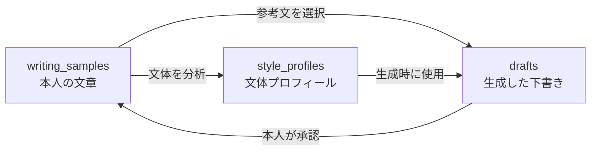

# データベース設計書

## 1. 文書情報

| 項目 | 内容 |
| --- | --- |
| 対象システム | Tabelog Writer |
| データベース | Cloudflare D1 |
| SQL互換性 | SQLite |
| 対象マイグレーション | `migrations/0001_initial_schema.sql` |
| 作成日 | 2026-07-18 |

この文書は、現在のマイグレーションSQLを正本としてデータ構造を説明する。

## 2. 目的

本人の過去の口コミから文体を抽出し、その文体を使って生成した下書きを、本人の確認後に新しい文体サンプルとして蓄積する。

保存対象は次の3種類である。

1. 本人が書いた文章
2. 過去文から抽出した文体プロフィール
3. AIが生成した下書きと本人が修正した完成稿

## 3. テーブル構成

| テーブル | 役割 | 主キー |
| --- | --- | --- |
| `writing_samples` | 過去の原文と承認済み完成稿を保存する | `id` |
| `style_profiles` | 媒体ごとの文体プロフィールを保存する | `platform` |
| `drafts` | AI生成文、修正文、検査結果、状態を保存する | `id` |

## 4. 論理的なデータの流れ



テーブル間に外部キーは定義しない。上図はアプリケーション上の処理関係であり、データベースが強制する参照関係ではない。

## 5. `writing_samples`

### 5.1 役割

スクレイピングで取り込んだ本人の原文と、本人が承認した完成稿を保存する。文体プロフィールの生成と、下書き生成時の参考文選択に使用する。

### 5.2 カラム定義

| カラム | 型 | NULL | 制約 | 内容 |
| --- | --- | --- | --- | --- |
| `id` | TEXT | 不可 | PRIMARY KEY | 文章を一意に識別するID |
| `platform` | TEXT | 不可 | なし | 投稿先。MVPでは食べログ |
| `source_type` | TEXT | 不可 | `imported`または`approved` | 文章の由来 |
| `source_url` | TEXT | 可 | なし | 元の投稿URL。未投稿ならNULL |
| `subject_name` | TEXT | 可 | なし | 店名など、文章の対象名 |
| `title` | TEXT | 可 | なし | 口コミタイトル |
| `content` | TEXT | 不可 | なし | 口コミ本文 |
| `rating` | REAL | 可 | 0以上5以下 | 評価値 |
| `metadata_json` | TEXT | 可 | 正しいJSON | 媒体固有の追加情報 |
| `created_at` | TEXT | 不可 | なし | 作成日時。ISO 8601形式を使用する |
| `updated_at` | TEXT | 不可 | なし | 更新日時。ISO 8601形式を使用する |

### 5.3 ID規則

- インポートした文章：`tabelog:{sourceReviewUrl}`をSHA-256で変換した値
- 承認した完成稿：`approved:{draft_id}`

IDはアプリケーション側で生成する。データベースによる自動採番は行わない。

### 5.4 インデックス

| 名前 | 対象 | 目的 |
| --- | --- | --- |
| `idx_writing_samples_platform` | `platform` | 同じ投稿先の参考文を絞り込む |

`source_type`には、現時点で単独検索の要件がないためインデックスを作成しない。

## 6. `style_profiles`

### 6.1 役割

過去文全体から抽出した文体、構成、語彙、ユーモアなどの特徴を、投稿先ごとに1件保存する。

### 6.2 カラム定義

| カラム | 型 | NULL | 制約 | 内容 |
| --- | --- | --- | --- | --- |
| `platform` | TEXT | 不可 | PRIMARY KEY | 投稿先。1媒体につき1件 |
| `profile` | TEXT | 不可 | なし | 抽象化した文体プロフィール |
| `sample_count` | INTEGER | 不可 | 0以上 | プロフィール生成に使った文章数 |
| `updated_at` | TEXT | 不可 | なし | 更新日時。ISO 8601形式を使用する |

プロフィールには、具体的な店名、料理、人物、出来事を含めない。

## 7. `drafts`

### 7.1 役割

利用者が入力した事実、AI生成文、事実混入検査の結果、本人による修正文と承認状態を保存する。

### 7.2 カラム定義

| カラム | 型 | NULL | 制約 | 内容 |
| --- | --- | --- | --- | --- |
| `id` | TEXT | 不可 | PRIMARY KEY | 下書きID。UUIDを使用する |
| `platform` | TEXT | 不可 | なし | 投稿先 |
| `input_json` | TEXT | 不可 | 正しいJSON | 利用者が入力した事実 |
| `generated_title` | TEXT | 可 | なし | AIが生成したタイトル |
| `generated_body` | TEXT | 不可 | なし | AIが生成した本文 |
| `final_title` | TEXT | 可 | なし | 本人が修正したタイトル |
| `final_body` | TEXT | 可 | なし | 本人が修正した本文 |
| `status` | TEXT | 不可 | 定義済みの4状態 | 現在の処理状態 |
| `model` | TEXT | 不可 | なし | 生成に使用したAIモデル |
| `check_result_json` | TEXT | 不可 | 正しいJSON | 事実混入検査の結果 |
| `created_at` | TEXT | 不可 | なし | 作成日時。ISO 8601形式を使用する |
| `updated_at` | TEXT | 不可 | なし | 更新日時。ISO 8601形式を使用する |

### 7.3 状態

| 値 | 意味 |
| --- | --- |
| `generated` | 生成と検査が正常に完了した |
| `blocked` | 検査で問題が見つかり、承認できない |
| `approved` | 本人が完成稿として承認した |
| `rejected` | 本人が不採用にした |

状態遷移の妥当性はアプリケーションで検証する。データベースは、状態値が上記4種類のいずれかであることだけを保証する。

### 7.4 インデックス

主キーの`id`で1件取得するため、追加インデックスは作成しない。状態別一覧などの検索要件が追加された時点で、実際のSQLに基づいて追加を判断する。

## 8. SQL制約

| 制約 | 対象 | 保証すること |
| --- | --- | --- |
| PRIMARY KEY | 各テーブルの主キー | 値が重複しない |
| NOT NULL | 必須カラム | NULLを保存できない |
| CHECK + IN | `source_type`、`status` | 定義外の値を保存できない |
| CHECK + BETWEEN | `rating` | NULLまたは0〜5だけを保存できる |
| CHECK | `sample_count` | 0以上だけを保存できる |
| `json_valid()` | JSONカラム | 壊れたJSON文字列を保存できない |

日時の形式、IDの形式、状態遷移、JSON内部の項目構造は、データベースではなくアプリケーションで検証する。

## 9. SQL文法

### 9.1 コメント

```sql
-- Migration number: 0001
```

`--`から行末まではコメントであり、SQLとして実行されない。

### 9.2 テーブル作成

```sql
CREATE TABLE writing_samples (...);
```

- `CREATE TABLE`：新しいテーブルを作る
- `writing_samples`：テーブル名
- `(...)`：カラムと制約を並べる
- `,`：次のカラム定義との区切り
- `;`：1つのSQL文の終了

### 9.3 カラム定義

```sql
id TEXT PRIMARY KEY NOT NULL
```

- `id`：カラム名
- `TEXT`：文字列として扱う型
- `PRIMARY KEY`：行を一意に識別する
- `NOT NULL`：NULLを禁止する

SQLiteでは`TEXT PRIMARY KEY`だけではNULLを許す場合があるため、`NOT NULL`を明示する。

### 9.4 データ型

| 型 | 用途 |
| --- | --- |
| TEXT | ID、文章、日時、JSON文字列 |
| INTEGER | 整数の件数 |
| REAL | 小数を含む評価値 |

D1はSQLite互換である。日時専用型は使用せず、日時はISO 8601文字列としてTEXTへ保存する。

### 9.5 候補値の限定

```sql
CHECK (source_type IN ('imported', 'approved'))
```

- `CHECK`：保存時に条件を検査する
- `IN (...)`：列の値が候補のどれかに一致するか調べる

この例では、`source_type`に2種類以外の文字列を保存できない。

### 9.6 数値範囲

```sql
CHECK (rating IS NULL OR rating BETWEEN 0 AND 5)
```

- `IS NULL`：値がNULLか確認する
- `OR`：左右どちらかが正しければ許可する
- `BETWEEN 0 AND 5`：0以上5以下か確認する

評価値を持たない媒体ではNULLを許し、値がある場合だけ範囲を制限する。

### 9.7 JSON検証

```sql
CHECK (metadata_json IS NULL OR json_valid(metadata_json))
```

`json_valid()`は、TEXTの内容が正しいJSONなら真を返す。任意項目の`metadata_json`はNULLも許可し、必須項目の`input_json`と`check_result_json`はNULLを許可しない。

### 9.8 インデックス作成

```sql
CREATE INDEX idx_writing_samples_platform
  ON writing_samples (platform);
```

- `CREATE INDEX`：検索用の索引を作る
- `idx_writing_samples_platform`：インデックス名
- `ON writing_samples`：対象テーブル
- `(platform)`：索引を作るカラム

インデックスは検索を速くする一方、書き込みと保存容量にコストがかかるため、実際の検索条件に必要なものだけ作成する。

## 10. マイグレーション運用

- 運用開始前は、初期スキーマの修正を`0001_initial_schema.sql`へ統合してよい。
- 運用開始後は、適用済みファイルを編集せず、新しい連番のマイグレーションを追加する。
- ローカルD1を初期化した場合は、連番順にすべてのマイグレーションを再適用する。
- リモート適用前に、空のローカルD1への適用と制約違反SQLを検証する。

## 11. 現時点で定義しないもの

- 外部キー
- 自動採番
- 日時の自動入力
- 状態遷移を強制するトリガー
- JSON内部構造を検証する複雑なCHECK制約
- 下書き一覧用インデックス

これらは現在のMVP要件には不要であり、具体的な利用要件が追加された時点で検討する。
