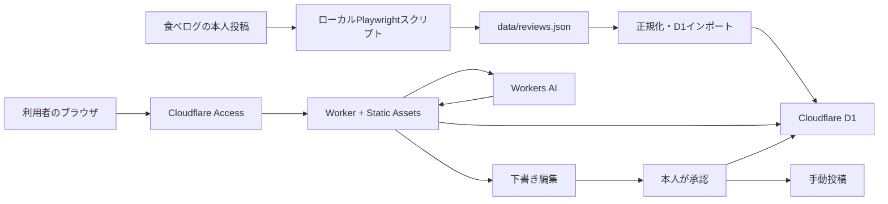
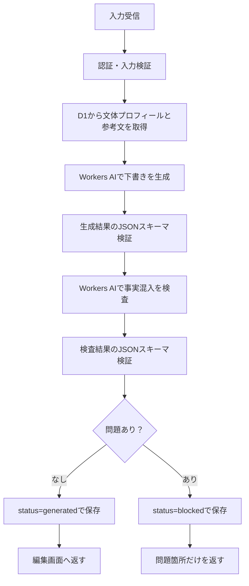

# 個人用口コミライティング支援システム 設計書

## 1. 文書情報

| 項目 | 内容 |
| --- | --- |
| 対象 | MVP（最小実用版） |
| 構成 | ローカル収集スクリプト + Cloudflare Workers |
| 利用者 | 所有者本人のみ |
| デプロイ先 | `workers.dev` |
| 費用方針 | Cloudflare無料枠内で運用する |
| 目的 | 過去に自分が書いた口コミの文体を参考に、新しい体験から投稿用の下書きを生成する |

## 2. 背景と目的

現在は `scripts/scrape-tabelog.ts` により、本人が食べログへ投稿した口コミを `data/reviews.json` に保存できる。

本システムでは、収集した原文と本人が承認した完成稿をCloudflare D1へ保存する。新しい飲食体験を入力すると、過去の文章から抽出した文体プロフィールと参考文を使い、Workers AIが口コミの下書きを生成する。

生成結果は自動投稿しない。利用者が事実と表現を確認・修正し、完成稿として承認した後、対象プラットフォームへ手動で投稿する。承認した完成稿は、次回以降の文体参考データとして蓄積する。

## 3. 設計方針

1. **今回の入力だけを事実として扱う**
   - 過去の口コミは文体・構成・語彙の参考に限定する。
   - 過去の店名、料理、価格、人物、会話、出来事を新しい口コミへ転用しない。
2. **収集と生成を分離する**
   - 食べログ固有の収集処理はローカルのTypeScriptで行う。
   - 入力画面、保存、生成、承認はCloudflare上で行う。
3. **人間による確認を必須にする**
   - 外部サービスへの自動投稿機能は実装しない。
   - AIによる検査を通過しても、本人による最終確認を省略しない。
4. **無料枠と小規模データに合わせる**
   - Dify、Supabase、n8n、外部LLM APIは導入しない。
   - MVPではベクトル検索を使用しない。
5. **承認済みの文章だけを学習資産にする**
   - 他者の口コミは保存しない。
   - 未確認のAI生成文は次回の参考データにしない。
6. **異常を隠さない**
   - AI出力、認証、入力、保存の検証に失敗した場合は処理を停止する。
   - デバッグ目的のフォールバックは実装しない。

## 4. スコープ

### 4.1 MVPに含める

- 食べログへ投稿した本人の口コミ収集
- 安定した口コミIDを持つ共通データへの変換
- D1への口コミインポート
- Cloudflare Accessによる本人限定認証
- 新しい体験の構造化入力画面
- 文体プロフィールと参考文を使った下書き生成
- 入力にない事実と過去文の固有情報に対するAI検査
- 下書きの編集、承認、不採用
- 承認済み完成稿の蓄積
- `workers.dev`へのデプロイ

### 4.2 MVPに含めない

- 食べログへの自動投稿
- GoogleマップやSNSからの自動収集
- 複数利用者への提供
- 画像解析
- ファインチューニング
- ベクトル検索
- 定期実行
- 独自ドメイン
- Cloudflare無料枠を超える有料利用

## 5. システム構成



### 5.1 ローカル側の責務

- 食べログから本人の投稿だけを取得する。
- 口コミ詳細URLを含む安定したIDを生成する。
- 収集結果を検証してからJSONを更新する。
- D1へ同じIDでupsertし、重複登録を防ぐ。
- Cloudflareの認証情報をGitへ保存しない。

### 5.2 Cloudflare側の責務

| サービス | 責務 |
| --- | --- |
| Workers Static Assets | 本人用の入力・編集画面を配信する |
| Worker | API、入力検証、AI呼び出し、保存、状態遷移を担当する |
| Cloudflare Access | Workerの全URLを本人のメールアドレスだけに公開する |
| D1 | 過去文、文体プロフィール、下書き、完成稿を保存する |
| Workers AI | 下書き生成と事実混入検査を行う |

## 6. データ設計

### 6.1 収集JSON

`data/reviews.json` の各要素を次の形式へ変更する。

```ts
type CollectedReview = {
  id: string;
  platform: "tabelog";
  sourceReviewUrl: string;
  subjectName: string;
  subjectUrl: string;
  title: string | null;
  body: string | null;
  rating: number;
  likeCount: number;
  collectedAt: string;
};
```

`id` は次の値からSHA-256で生成する。

```text
tabelog:{sourceReviewUrl}
```

口コミ詳細URLを基準にするため、取得順が変わってもIDは変わらない。同じ店舗への複数投稿も別の口コミとして扱える。既存JSONには詳細URLが保存されていないため、スキーマ変更後に再収集する。

`body` が `null` の口コミは収集記録には残すが、文体参考データにはしない。

### 6.2 D1テーブル

#### `writing_samples`

本人が書いた原文と、本人が承認した完成稿を保存する。

| 列 | 型 | 制約・用途 |
| --- | --- | --- |
| `id` | TEXT | PRIMARY KEY。収集IDまたは`approved:{draft_id}` |
| `platform` | TEXT | NOT NULL |
| `source_type` | TEXT | `imported`または`approved` |
| `source_url` | TEXT | 外部投稿URL。未投稿ならNULL |
| `subject_name` | TEXT | 店名などの対象名 |
| `title` | TEXT | タイトル。未入力ならNULL |
| `content` | TEXT | NOT NULL。本文 |
| `rating` | REAL | 評価がない媒体ではNULL |
| `metadata_json` | TEXT | 媒体固有情報をJSONで保存 |
| `created_at` | TEXT | ISO 8601 |
| `updated_at` | TEXT | ISO 8601 |

`platform` と `source_type` にインデックスを作成する。

#### `style_profiles`

過去文全体から抽象化した文体の特徴を保存する。具体的な店名、料理、人物、出来事は含めない。

| 列 | 型 | 制約・用途 |
| --- | --- | --- |
| `platform` | TEXT | PRIMARY KEY |
| `profile` | TEXT | NOT NULL。文体、構成、語彙、ユーモアの特徴 |
| `sample_count` | INTEGER | 生成時に使用した文章数 |
| `updated_at` | TEXT | ISO 8601 |

MVPでは初回インポート時にプロフィールを作成する。その後は承認済み完成稿が5件増えるごとに、本人の操作で再生成する。

#### `drafts`

| 列 | 型 | 制約・用途 |
| --- | --- | --- |
| `id` | TEXT | PRIMARY KEY。UUID |
| `platform` | TEXT | NOT NULL |
| `input_json` | TEXT | NOT NULL。今回入力した事実 |
| `generated_title` | TEXT | AIが生成したタイトル |
| `generated_body` | TEXT | AIが生成した本文 |
| `final_title` | TEXT | 本人が修正したタイトル |
| `final_body` | TEXT | 本人が修正した本文 |
| `status` | TEXT | `generated`、`blocked`、`approved`、`rejected` |
| `model` | TEXT | 使用したWorkers AIモデル |
| `check_result_json` | TEXT | 事実混入検査の結果 |
| `created_at` | TEXT | ISO 8601 |
| `updated_at` | TEXT | ISO 8601 |

## 7. 入力設計

| 変数名 | 表示名 | 型 | 必須 | 制約 |
| --- | --- | --- | --- | --- |
| `platform` | 投稿先 | Select | 必須 | MVPでは`食べログ`固定 |
| `restaurantName` | 店名 | Short Text | 必須 | 1〜100文字 |
| `orderedItems` | 注文したもの | Paragraph | 必須 | 1〜1,000文字 |
| `experienceFacts` | 体験した事実 | Paragraph | 必須 | 1〜3,000文字 |
| `rating` | 評価 | Number | 必須 | 0〜5、0.1刻み |
| `personalEpisode` | 個人的エピソード | Paragraph | 任意 | 最大2,000文字 |
| `desiredLength` | 文章量 | Select | 必須 | 短め・標準・長め |
| `draftNotes` | その他の要望 | Paragraph | 任意 | 最大1,000文字 |

評価はAIに決めさせず、必ず本人が入力する。個人的エピソードには、公開してよい内容だけを入力する。

## 8. 参考文の選択

MVPではデータ件数が少ないためVectorizeを使用しない。D1から次の条件で最大3件を選ぶ。

1. 投稿先が同じ文章に限定する。
2. 入力評価に最も近い文章を優先する。
3. 希望する文章量に近い文章を優先する。
4. `imported`と`approved`の両方を候補にする。
5. 同じ文章を重複して選ばない。

文体プロフィールは常に使用する。参考文は文体再現を補助するための例であり、事実の情報源として扱わない。

複数媒体を含めて文体サンプルが100件を超え、単純選択で期待する参考文を取得できなくなった場合に限り、Cloudflare Vectorizeを再検討する。

## 9. 生成処理

### 9.1 API

| メソッド | パス | 用途 |
| --- | --- | --- |
| `POST` | `/api/drafts/generate` | 下書きを生成・検査して保存する |
| `GET` | `/api/drafts/:id` | 下書きを取得する |
| `PUT` | `/api/drafts/:id` | 本人の修正文を保存する |
| `POST` | `/api/drafts/:id/approve` | 完成稿として承認する |
| `POST` | `/api/drafts/:id/reject` | 下書きを不採用にする |
| `POST` | `/api/style-profile/regenerate` | 文体プロフィールを再生成する |

すべてのAPIをCloudflare Accessの保護対象にする。

### 9.2 生成フロー



AIが有効なJSONを返さない場合、再解釈や別モデルへの切り替えは行わず、エラーとして停止する。

### 9.3 下書き生成プロンプト

```text
あなたは、利用者本人の口コミ執筆を支援する編集者です。

今回の事実として使用できるのは「今回の入力」だけです。
「文体プロフィール」と「参考文章」は、文体、語彙、文の長さ、段落構成、ユーモアの程度だけを参考にしてください。

禁止事項:
- 参考文章にある店名、料理、価格、人物、会話、出来事を出力へ持ち込まない
- 入力されていない事実を補完しない
- 評価点を変更しない
- 過度に宣伝的な文章にしない
- 参考文章の表現を長くそのまま複製しない

個人的エピソードが空の場合は、日記的な内容を創作しないでください。
入力された味、サービス、雰囲気、価格などの具体的な感想を中心にしてください。

指定されたJSON形式だけを返してください。
```

生成結果は次の形式に固定する。

```json
{
  "title": "タイトル案",
  "body": "口コミ本文"
}
```

### 9.4 事実混入検査

検査には次の3種類をすべて渡す。

- 今回の入力
- 生成した下書き
- 実際に参照した過去文

検査結果は次の形式に固定する。

```json
{
  "hasUnsupportedFact": false,
  "unsupportedFacts": [],
  "hasReferenceLeak": false,
  "referenceLeaks": []
}
```

問題が1件でもあれば`blocked`として保存し、正常な下書きとして表示しない。AI検査は誤りを完全には防げないため、正常時の表示は「自動チェック上、問題は見つかりませんでした。投稿前に本人確認が必要です」とする。

## 10. 承認処理

1. 利用者が生成文を編集する。
2. 完成稿の店名、価格、個人情報、誇張、評価を確認する。
3. 「完成稿として保存」を実行する。
4. `drafts.status`を`approved`へ変更する。
5. 同一トランザクション内で`writing_samples`へ`approved:{draft_id}`として追加する。
6. 利用者が完成稿をコピーして手動投稿する。

承認APIは、本文が空の場合や`blocked`状態の下書きを直接承認しようとした場合に拒否する。`blocked`を解除する専用操作は設けず、新しい事実入力から再生成する。

## 11. 認証・セキュリティ・プライバシー

- `workers.dev`の全ルートにCloudflare Accessを設定する。
- Accessポリシーでは本人のメールアドレスだけを許可する。
- WorkerはAccess JWTの署名、Issuer、Audience、有効期限を検証する。
- Accessを通らないリクエストへ画面やAPIを返さない。
- AIモデルの指定や設定値はWorker側で管理し、ブラウザから変更させない。
- 秘密情報をGit、静的ファイル、ブラウザのJavaScriptへ埋め込まない。
- 入力値をプロンプト命令ではなくデータとして明確に区切る。
- D1へ保存する前に文字数、型、許容値を検証する。
- 原文、下書き、完成稿、実行ログを本人が削除できるよう将来拡張できるスキーマにする。
- 自動投稿を行わず、公開前に本人が事実性と表現を確認する。

## 12. 無料枠と制限

2026年7月18日時点で、個人利用は次の無料枠内に収める。

| サービス | 無料枠 | MVPでの想定 |
| --- | --- | --- |
| Workers | 100,000リクエスト/日 | 数十リクエスト/日未満 |
| Static Assets | 静的アセットのリクエストは無料 | 入力・編集画面のみ |
| D1 | 5,000,000行読取/日、100,000行書込/日、合計5GB | 数百件未満 |
| Workers AI | 10,000 Neurons/日 | 個人による下書き生成 |

無料枠を超えた場合は有料プランへ自動移行せず、処理失敗をそのまま表示する。外部LLM APIへの切り替えは行わない。

Workers AIのモデル名はWorkerの設定値`AI_MODEL`として管理する。初期実装時に、日本語の文体再現、JSON遵守、生成量あたりのNeuron消費を複数候補で比較し、受け入れテストを通過したモデルを固定する。

## 13. エラー方針

| 条件 | 動作 |
| --- | --- |
| Access認証がない・不正 | 処理せず拒否する |
| 必須入力がない・制約外 | AIを呼ばず入力エラーを返す |
| 文体プロフィールがない | 生成せず初期設定エラーを返す |
| 参考文が0件 | 生成せずインポート確認を求める |
| AI出力がJSONスキーマに違反 | 保存せず生成エラーを返す |
| 入力にない事実・参考文流用を検出 | `blocked`で保存し、問題箇所を返す |
| Workers AI無料枠超過 | 別モデルへ切り替えず、上限エラーを返す |
| D1保存失敗 | 成功として返さない |
| 収集失敗 | 既存JSONを上書きしない |
| インポート失敗 | 対象IDを表示して停止する |

## 14. 運用フロー

### 14.1 初期登録

1. 収集スクリプトへ安定したIDと詳細URLの保存を追加する。
2. `npm run scrape`で口コミを再収集する。
3. 取得件数、ID重複、本文、評価を検証する。
4. 本文がある口コミをD1へupsertする。
5. 全文から、固有の事実を含まない文体プロフィールを生成する。
6. 受け入れテストを行う。
7. Workerを`workers.dev`へデプロイする。
8. Cloudflare Accessで本人のメールアドレスだけを許可する。

### 14.2 過去文の更新

1. ローカルで`npm run scrape`を実行する。
2. JSONの検証後、同じIDでD1へupsertする。
3. 5件以上増えた場合、本人が文体プロフィールを再生成する。

MVPでは都度実行とし、定期実行は行わない。

### 14.3 下書き作成

1. Cloudflare Accessでログインする。
2. 今回の体験を入力する。
3. 自動検査を通過した下書きを原体験と照合する。
4. 本人が文章を修正する。
5. 完成稿として承認・保存する。
6. 対象サービスへ手動投稿する。

## 15. 受け入れ条件

### 15.1 収集・同期

- 口コミごとに詳細URL由来の安定したIDを生成できる。
- 取得順が変わってもIDが変わらない。
- 同じ店舗への複数投稿を区別できる。
- 同じJSONを複数回インポートしても重複しない。
- 収集または検証に失敗した場合、既存JSONを上書きしない。

### 15.2 認証

- 許可した本人のメールアドレスだけが画面とAPIへアクセスできる。
- 未認証または不正なAccess JWTのリクエストを拒否する。
- 静的画面だけを認証なしで閲覧することもできない。

### 15.3 生成

- 本人の文体プロフィールと最大3件の参考文を使用する。
- 入力した評価を変更しない。
- 過去文にしか存在しない店名、料理、人物、出来事を生成文へ持ち込まない。
- 個人的エピソードが空の場合、日記的な内容を創作しない。
- AI出力が指定JSON形式でない場合、正常結果として扱わない。
- AI検査の正常結果を事実保証とは表示しない。

### 15.4 保存・承認

- 生成文と本人による修正文を分けて保存する。
- 承認した完成稿だけが`writing_samples`へ追加される。
- 不採用の下書きは次回の文体参考に使用されない。
- `blocked`状態の下書きを直接承認できない。
- 生成結果は外部サービスへ自動投稿されない。

### 15.5 無料枠

- OpenAIなどの外部有料LLM APIを呼び出さない。
- Cloudflare無料枠超過時に有料サービスへフォールバックしない。
- 無料枠超過を利用者が識別できるエラーとして表示する。

## 16. テストケース

| ID | 条件 | 期待結果 |
| --- | --- | --- |
| T-01 | 未認証で画面を開く | Accessが拒否する |
| T-02 | 未認証でAPIを呼ぶ | Worker処理へ到達しない |
| T-03 | 同じJSONを2回インポート | D1の件数が増えない |
| T-04 | 同じ店舗の異なる口コミ | 別IDで保存される |
| T-05 | 味、接客、雰囲気を入力 | 3要素が事実どおり本文に含まれる |
| T-06 | 個人的エピソードなし | 人物や日記を創作しない |
| T-07 | 評価4.0を入力 | 評価を4.0として扱う |
| T-08 | 過去文に固有の人物が存在 | 生成文へその人物を持ち込まない |
| T-09 | AIが不正なJSONを返す | 保存せずエラーにする |
| T-10 | 事実混入を検出 | `blocked`となり正常表示しない |
| T-11 | 下書きを修正して承認 | 修正文が完成稿として保存される |
| T-12 | 不採用にする | 文体参考データへ追加されない |
| T-13 | Workers AI無料枠を超過 | フォールバックせず上限エラーを表示する |
| T-14 | D1保存が失敗 | 生成成功として表示しない |

## 17. 実装順序

1. 収集データへ`id`、`sourceReviewUrl`、`collectedAt`を追加する。
2. JSONの重複とデータ型を検証する。
3. Cloudflare WorkerプロジェクトとD1マイグレーションを追加する。
4. D1インポートスクリプトを追加する。
5. 文体プロフィール生成処理を追加する。
6. 入力・編集画面をStatic Assetsで作成する。
7. 参考文選択と下書き生成APIを追加する。
8. 事実混入検査とJSONスキーマ検証を追加する。
9. 修正、承認、不採用、完成稿蓄積を追加する。
10. ローカルとCloudflare上で受け入れテストを行う。
11. `workers.dev`へデプロイする。
12. Cloudflare Accessを有効化し、本人以外がアクセスできないことを確認する。

## 18. 将来拡張の判断基準

| 状況 | 拡張候補 |
| --- | --- |
| GoogleマップやSNSにも対応したい | 媒体別収集アダプターと共通入力項目を追加する |
| 文体サンプルが100件を超え、参考文選択の品質が不足 | Cloudflare Vectorizeを検討する |
| ローカル同期の手作業が負担 | 認証付きインポートAPIまたはCIを検討する |
| 複数利用者へ提供したい | 利用者ID、D1分離、権限設計を追加する |
| 十分な承認済み完成稿が蓄積し、プロンプトだけでは文体が安定しない | ファインチューニングを再検討する |
| 無料枠を継続的に超える | 利用量を計測した上でWorkers Paidを検討する |

## 19. 参考資料

- [Cloudflare Workers Pricing](https://developers.cloudflare.com/workers/platform/pricing/)
- [Cloudflare Workers Static Assets](https://developers.cloudflare.com/workers/static-assets/)
- [Cloudflare D1 Pricing](https://developers.cloudflare.com/d1/platform/pricing/)
- [Cloudflare Workers AI Pricing](https://developers.cloudflare.com/workers-ai/platform/pricing/)
- [Cloudflare Vectorize Pricing](https://developers.cloudflare.com/vectorize/platform/pricing/)
- [Cloudflare workers.dev Access](https://developers.cloudflare.com/workers/configuration/routing/workers-dev/)
- [食べログ利用規約](https://tabelog.com/help/rules/)
- [食べログ口コミガイドライン](https://tabelog.com/help/review_guide/)
