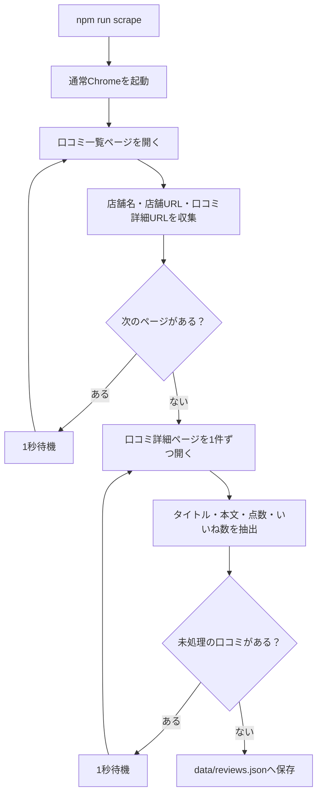
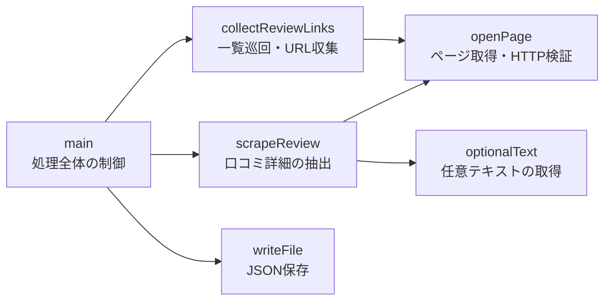

# Tabelog Review Scraper

指定した食べログユーザーの口コミを、一覧ページから自動取得してJSONへ保存するスクリプトです。

現在の取得対象：

```text
https://tabelog.com/rvwr/wi2kty/reviewed_restaurants/list
```

## 取得できる情報

| 項目 | 型 | 内容 |
| --- | --- | --- |
| `name` | `string` | 店舗名 |
| `url` | `string` | 店舗ページのURL |
| `title` | `string \| null` | 口コミタイトル。未入力の場合は `null` |
| `body` | `string \| null` | 省略されていない口コミ本文。未入力の場合は `null` |
| `rating` | `number` | 投稿者が付けた点数 |
| `likeCount` | `number` | 口コミへのいいね数 |

出力例：

```json
[
  {
    "name": "宝珍樓 向河原店",
    "url": "https://tabelog.com/kanagawa/A1405/A140504/14007628/",
    "title": "非常にほうちんでした",
    "body": "口コミ本文",
    "rating": 4.7,
    "likeCount": 5
  }
]
```

## 処理の仕組み



一覧ページの本文は途中で省略されるため、各口コミの詳細ページを開いて全文を取得します。詳細URLをキーに重複を除去し、「次の20件」がなくなるまで一覧を巡回します。

## 必要な環境

- Node.js
- Google Chrome
- npm

対象サイトは画面なしのブラウザへ403を返すため、処理中は通常のChromeが一時的に開きます。

## セットアップ

```bash
npm install
```

## 実行

```bash
npm run scrape
```

成功すると、取得件数が表示されます。

```text
21件を data/reviews.json に保存しました。
```

出力先：[`data/reviews.json`](data/reviews.json)

## 口コミ生成アプリのローカル起動

ローカルではWorkers AI REST API、本番ではWorkers AI Bindingを使用します。失敗時に別経路へ自動で切り替えることはありません。

### 1. Workers AI API Tokenを作成

1. Cloudflareダッシュボードで「Workers AI」を開く
2. 「Use REST API」を選ぶ
3. 「Create a Workers AI API Token」を選ぶ
4. 作成されたトークンをコピーする

独自にトークンを作る場合は、`Workers AI - Read` と `Workers AI - Edit` の権限が必要です。

### 2. ローカル設定

`.dev.vars` の `CLOUDFLARE_AI_API_TOKEN` に、コピーしたトークンを設定します。このファイルはGitの追跡対象外です。

```text
AI_TRANSPORT="rest"
CLOUDFLARE_ACCOUNT_ID="52ae66e464b0ab9acb6cb0ff72768ff8"
CLOUDFLARE_AI_API_TOKEN="ここにトークンを貼る"
```

設定例は [`.dev.vars.example`](.dev.vars.example) にあります。

### 3. 起動

```bash
npm run dev
```

表示されたローカルURLを開き、口コミ入力フォームから生成します。Workers AIはローカル実行でもCloudflare上で推論され、利用量に加算されます。

本番は `wrangler.jsonc` の `AI_TRANSPORT="binding"` を使用するため、API Tokenをデプロイする必要はありません。

## 入出力のルール

### 入力

- 取得開始URLは `scripts/scrape-tabelog.ts` の `START_URL`
- 一覧の全ページを対象にする
- 各ページへのアクセス間隔は1秒

### 出力

- JSON配列として保存する
- 本文は一覧の省略文ではなく、詳細ページの全文を使用する
- タイトル・本文が存在しない場合は `null`
- いいね表示が存在しない投稿は `0`
- 点数といいね数は文字列ではなく数値

## エラーになる条件

- ページ取得時のHTTPステータスが正常でない
- 一覧から店舗情報を取得できない
- 点数またはいいね数を数値へ変換できない
- 全投稿でいいね要素が見つからない

最後の条件は、食べログ側のHTML構造変更を0件として見逃さないための検証です。処理途中で失敗した場合、JSONは上書きされません。

## ファイル構成

```text
.
├── data/
│   └── reviews.json          # 取得結果
├── scripts/
│   └── scrape-tabelog.ts    # 取得処理
├── package.json             # npmスクリプトと依存関係
└── README.md
```

## 実装の責務



主な実装は [`scripts/scrape-tabelog.ts`](scripts/scrape-tabelog.ts) にあります。小規模なスクリプトとして過剰にファイル分割せず、変更理由ごとに関数を分けています。

## 注意事項

- 食べログ側のHTML構造が変わると、CSSセレクターの修正が必要です。
- 実行頻度や取得データの利用方法について、対象サイトの利用条件を確認してください。
- Chromeを閉じたり操作したりすると、実行が失敗する場合があります。
